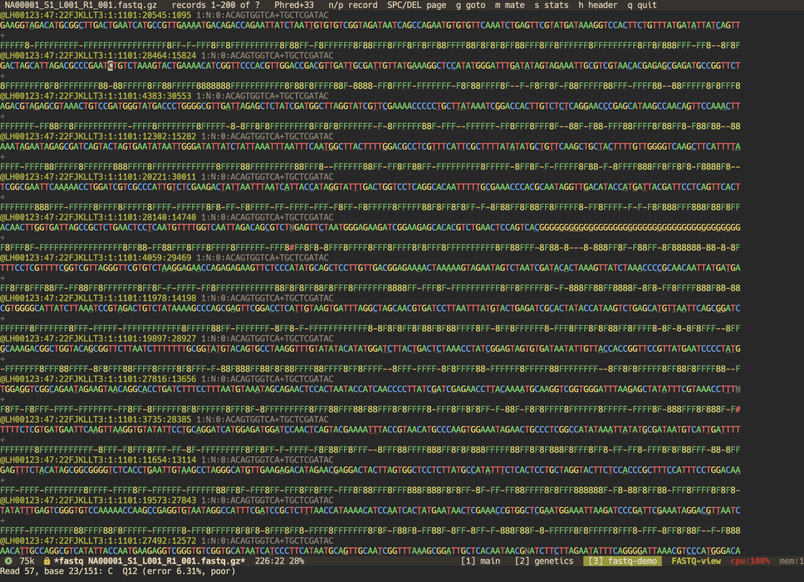
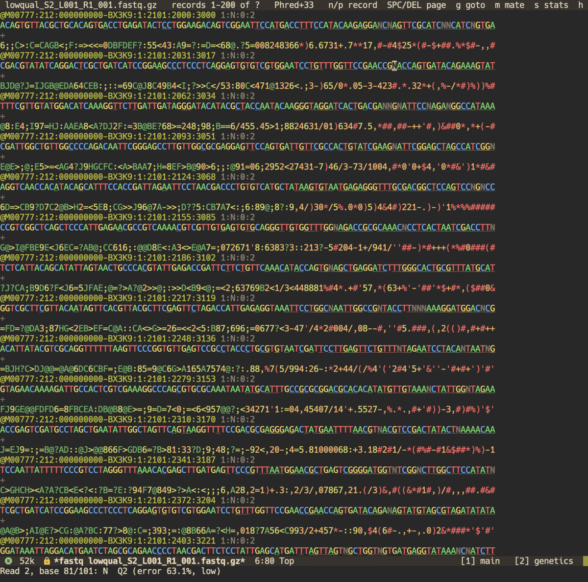
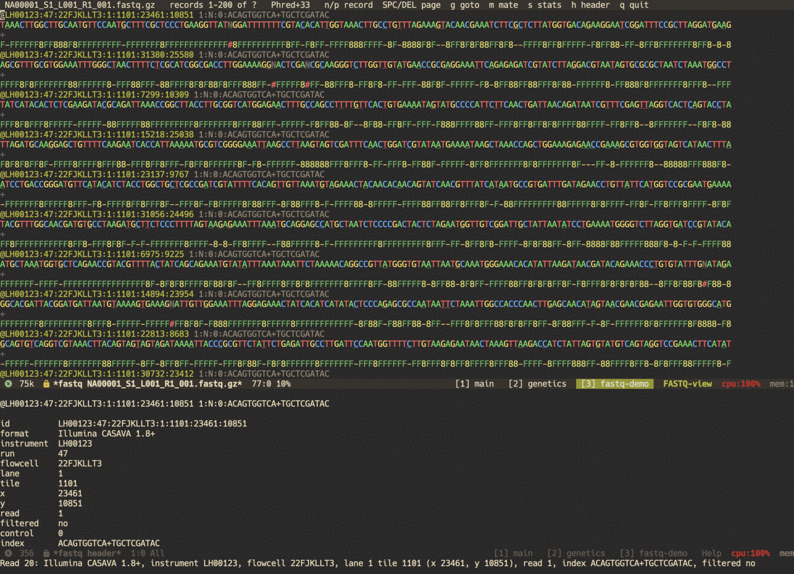
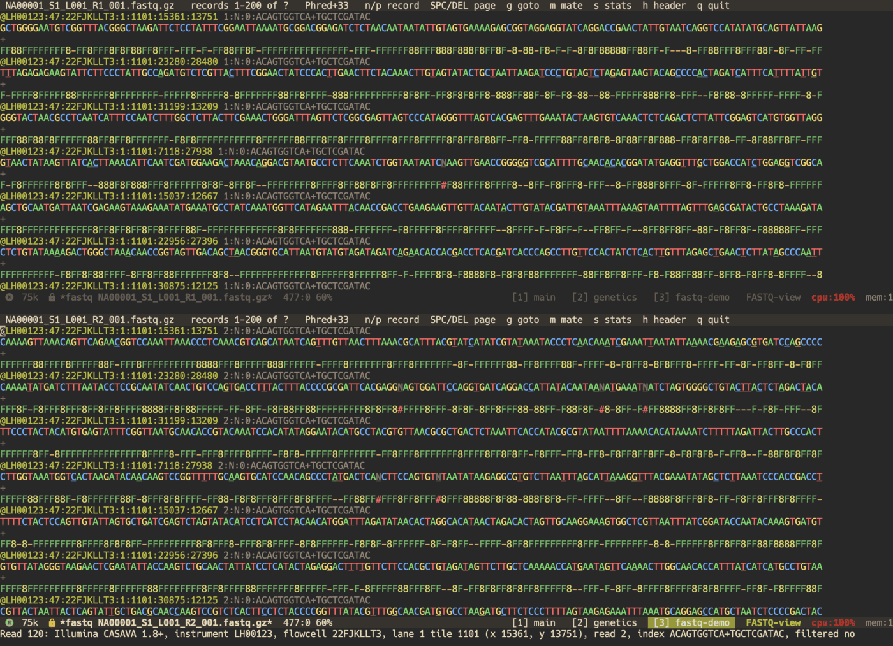
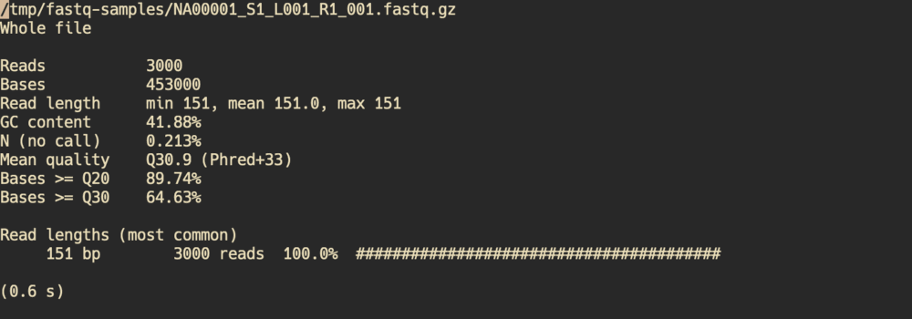
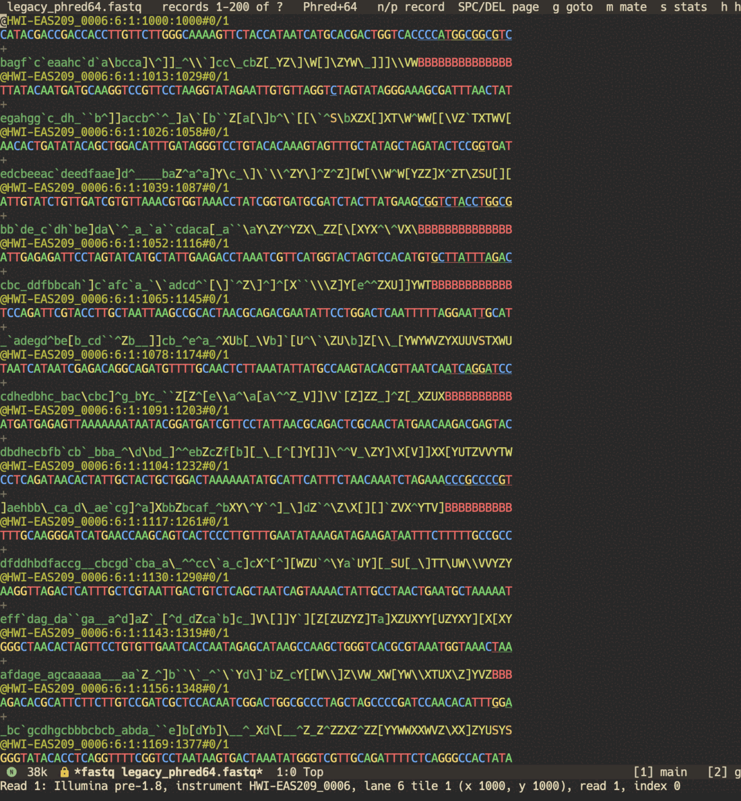

# fastq-mode screenshots

Every screenshot below is fastq-mode running in a terminal Emacs (Neomacs
with Doom, `-nw` in Alacritty) on the synthetic sample files in
[`examples/samples/`](../examples/samples/), generated by
[`examples/make-demo.py`](../examples/make-demo.py). None of it is real
sequencing data.

## Streaming viewer

A page of a 151 bp NovaSeq-style R1 file: bases coloured by nucleotide,
qualities by Phred bin, and weak bases (below Q20) underlined in the
sequence itself. Read 61 runs off the end of a short insert into the TruSeq
adapter (`AGATCGGAAGAGC...`) and then into a poly-G tail, the signature of
two-colour chemistry reading "no signal". The echo area is eldoc for the
base at point: position, Phred score and error probability.

## A failing run

An older-chemistry run going wrong: full-range Phred scores that fall off
steeply towards the 3' end, with many N (no-call) bases. The weak-base
marking makes the bad tail visible in the sequence without reading the
quality line.

## Header decoding

`h` on a read decodes its header into instrument, run, flowcell, lane,
tile, x/y cluster position, read number, filter flag and index sequences.
Eldoc gives the one-line version for whichever header point is on.

## Paired-end mates

`m` opens the mate file (R1 ↔ R2) at the same read number. The read names
match and differ only in the read field (`1:N:0` / `2:N:0`); fastq-mode
warns if they ever don't.

## Read statistics

`s` summarises a file: read count, bases, length distribution, GC and N
content, mean quality, and the share of bases at or above Q20 and Q30.
`C-u s` reads every record; with seqkit installed an exact whole-file
summary is added asynchronously.

## Legacy Phred+64

An Illumina 1.5-era file: pre-1.8 `@HWI-...#0/1` headers and Phred+64
qualities, detected automatically (see `Phred+64` in the header line). The
red `BBBB...` runs are the old Q2 "read segment quality control" tails.

## Regenerating

- Sample data: `python3 examples/make-demo.py` (seeded, byte-identical
  on every run).
- `make screenshots` renders headless SVG/PNG versions
  ([`viewer.svg`](screenshots/viewer.svg), [`stats.svg`](screenshots/stats.svg))
  from `examples/demo_R{1,2}_001.fastq.gz` without a display.
